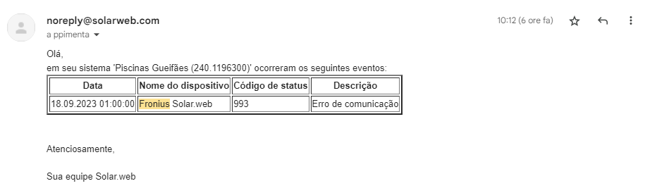

# Welcome to D4fa

Welcome to this repository.

This repository is being designed to share general data for introductory data analysis case studies.

## Data sets

Available data is organized in three datasets / folders, viz:

- HistoriMeteo - Historical Meteorological data
- PVProd - Historical PhotoVoltaic electrical energy production data
- HistoriAirQual - Historical Air Quality data

### HistoriMeteo

This data is maintained in the folder HistoriMetro, file CVerdevarios.csv, structured in 5 columns:
- datahora - timestamp, in format YYYY-MM-DD hh:mm:ss
- temperatura - Temperature in &deg;C (Celsius)
- pressão - atmospheric pressure (Pa)  
- humidade_Rel - Relative Humidity (%)
- radiação_W/m2 - solar radiation (W/m2)

These values are captured by a meteorological station (ATMOS 41, cf. [https://drive.google.com/drive/folders/1B8mCD9H7tJNS8jItDm71c3OLzMOxOWcd](Manual), located in "Cobertura Verde" (Lat: 41.234158, Lng: -8.623050), and updated to Maia Municipality data lake every 15 minutes.

(Please check [https://baze.cm-maia.pt/BaZe/cverde3.htm](https://baze.cm-maia.pt/BaZe/cverde3.htm))

### PVProd

This data is maintaned in the folder PVProd, file PVProd.csv, structured in 2 columns:
- datahora - timestamp, in format YYYY-MM-DD hh:mm:ss
- PVProd_kWh - Energy produced (kWh)

These values are collected by the control system (located in "Piscinas Municipais de Gueifães" (Lat: 41.215143, Lng: -8.600758), and every day, by 10AM, we receive an email with a link for a xls file with the data from the previous day.
This email is processed around 12AM, and, thus, by 12AM the data lake is updated with "previous day" data.

(Please check [https://baze.cm-maia.pt/BaZe/consumoe.htm?cpe=PISCGFPRODFV](https://baze.cm-maia.pt/BaZe/consumoe.htm?cpe=PISCGFPRODFV))

*Note*: 
- We have received data from June 1st to September 8th - from this data the email message reports the error bellow:
- In the past days, I'm receiving the following error message:
  
I've already reported this situation to Fronius.

### HistoriAirQual

This data is maintained in the folder HistoriAirQual, file AirQual.csv, structured in 9 columns:
- datahora -  timestamp, in format YYYY-MM-DD hh:mm:ss
- local - location of the sensor
- CO - Carbon monoxide
- NO2 - Nitrogen dioxide
- O3 - Ozone
- SO2 - Sulfur Dioxide
- PM2_5 - particulate matter 2.5 micrometers or smaller
- PM10 - particulate matter 10 micrometers or smaller
- noise_db - Noise (dB)

These values are reported for 4 different locations, viz:
- FORUM DA MAIA  (Lng: -8.624792, Lat: 41.234678)
- ROTUNDA DA ESTRADA NACIONAL N14 (Lng:-8.616665, Lat:41.260067)
- Sao Frutuoso  (Lng:-8.556982, Lat:41.258324)
- Novo Local  (Lng:-8.595962, Lat:41.229284)

(Please check [https://baze.cm-maia.pt/BaZe/pwall2.htm](https://baze.cm-maia.pt/BaZe/pwall2.htm))

## Follow-up
For more information about this data, or improvement suggestions, please contact ppimenta@ipmaia.pt.

PCP, September 20th 2023
